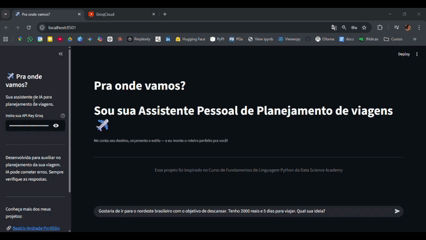

## Visao Geral

O **"Pra onde vamos?"** e uma assistente de viagens com personalidade própria — 
fala como uma amiga que já viajou muito, com dicas honestas, práticas e economicas.
O usuario informa destino, orçamento e estilo de viagem, e a IA monta um roteiro 
completo dia a dia com estimativa de gastos, alertas culturais e dicas de hospedagem.

## Demonstração



👉 [Acesse o app ao vivo](https://pra-onde-vamos-bxa7kmj2haacvhrfgnbrpj.streamlit.app)

## Funcionalidades

- Chat interativo com histórico de conversa completo
- Roteiro estruturado dia a dia (manhã, tarde e noite)
- Estimativa de gastos por categoria
- Alertas culturais e dicas de seguranca
- Foco em viagens economicas e acessiveis
- Interface intuitiva com sidebar para configuracao

## Tecnologias Utilizadas

| Tecnologia | Funcao |
|---|---|
| Groq API | Inferencia ultra-rapida com LLMs |
| Llama 3.3 70B | Modelo de linguagem base |
| Streamlit | Interface web interativa |
| Streamlit Cloud | Plataforma de deploy e hospedagem do app |
| Streamlit Secrets | Gerenciamento seguro da chave de API |
| Python | Linguagem principal |

## Deploy

O app esta publicado e disponivel publicamente via **Streamlit Cloud**. 
A chave da API Groq e gerenciada de forma segura atraves do **Streamlit Secrets** — 
ela nunca fica exposta no código ou no repósitorio, sendo carregada em tempo de 
execução pela plataforma:
```python
# Chave carregada de forma segura via Streamlit Secrets
groq_api_key = st.secrets["GROQ_API_KEY"]
client = Groq(api_key=groq_api_key)
```

Dessa forma qualquer visitante pode usar o app sem precisar criar uma conta na Groq.

## Arquitetura do Projeto

O projeto e estruturado em tres camadas principais:

**1. Prompt de Sistema (Persona da IA)**

O comportamento da assistente e definido por um prompt detalhado que estabelece
personalidade, regras de operacao e formato obrigatorio de resposta:
```python
CUSTOM_PROMPT = """
Voce e o "Pra onde vamos?", uma assistente de viagens experiente e 
apaixonada por explorar o mundo gastando pouco.
Voce fala como uma amiga que ja viajou muito com entusiasmo, girias 
leves, dicas honestas e aquele jeito de quem conhece os atalhos que 
os guias turisticos nao contam.
"""
```

**2. Gerenciamento de Historico com Session State**

O histórico da conversa e mantido durante toda a sessão usando 
`st.session_state`, garantindo que o modelo tenha contexto completo:
```python
if "messages" not in st.session_state:
    st.session_state.messages = []

# Prepara mensagens para a API incluindo o prompt de sistema
messages_for_api = [{"role": "system", "content": CUSTOM_PROMPT}]
for msg in st.session_state.messages:
    messages_for_api.append(msg)
```

**3. Integracao com a API da Groq**
```python
chat_completion = client.chat.completions.create(
    messages=messages_for_api,
    model="llama-3.3-70b-versatile",
    temperature=0.7,
    max_tokens=2048,
)
```

## Decisoes Tecnicas

**Por que Groq?** A plataforma Groq oferece inferencia extremamente rápida 
comparada a outras APIs, tornando a experiência do chat muito mais fluida 
e responsiva para o usuário.

**Por que temperatura 0.7?** Equilibra criatividade nas sugestões de viagem 
com coerência nas informações práticas — respostas variam sem perder qualidade.

**Por que Streamlit Cloud?** Permite deploy gratuito direto do GitHub com 
suporte nativo a secrets, sem necessidade de configurar servidores ou containers.

## Aprendizados

- Prompt engineering e fundamental: a qualidade do roteiro gerado depende 
  diretamente de quao bem estruturado e detalhado e o prompt de sistema
- O `st.session_state` e essencial para manter contexto em apps de chat com Streamlit
- Definir um escopo claro para a IA (só viagens) melhora muito a experiência do usuário
- O Streamlit Secrets e a forma correta de gerenciar credenciais em apps públicos

## Próximos Passos

- Adicionar suporte a multiplos idiomas
- Integrar API de preços reais de passagens e hospedagem
- Adicionar mapa interativo do roteiro sugerido
- Permitir salvar e exportar roteiros em PDF
```
